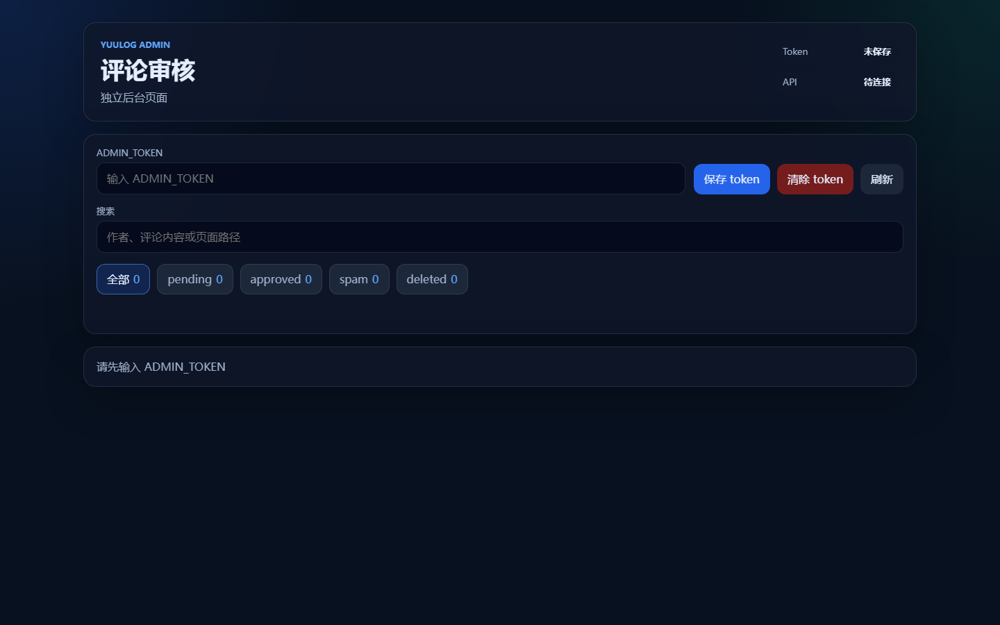
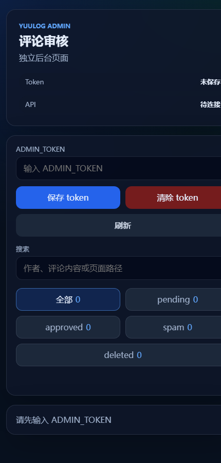

# 从零给 Mizuki 添加评论区

这篇文章记录的是我怎样给已经能正常访问的 `Mizuki` 博客，从零补上一套评论系统。

目标不是重新部署整个博客，而是把下面几件事接起来：

1. 让文章页底部出现可提交的评论框。
2. 用 Cloudflare Turnstile 做人机验证。
3. 用独立后端保存评论数据。
4. 留出一个可视化后台，后续可以查看和处理评论。

我这里用到的是：

- 博客前端：`Mizuki`
- 评论后端：`yuulog-comments`
- 前端部署平台：Vercel
- 后端部署平台：Cloudflare Workers + D1
- 包管理器：`pnpm`
- 本地环境：Windows PowerShell

如果你已经把 `Mizuki` 部署好了，这篇文章就是从“没有评论区”到“评论区可用”的补装流程。前端如果不是部署在 Vercel，只要你能配置环境变量并重新发布，整体思路也一样。

## 1. 先理解评论区由什么组成

### 1.1 前端这一侧要做什么

在 `Mizuki` 里，评论区并不是凭空出现的，主要依赖这些内容：

它的关键文件有：

- `package.json`
  - `pnpm dev`：本地开发
  - `pnpm build`：生产构建
  - `pnpm preview`：预览构建结果
- `.env.example`
  - `PUBLIC_COMMENTS_API_BASE_URL`
  - `PUBLIC_TURNSTILE_SITE_KEY`
- `src/components/comments/CommentBox.astro`
  - 真正调用评论后端接口的评论组件
- `public/admin/index.html`
  - 独立的评论审核后台页面，部署后通过 `/admin/` 访问
- `src/pages/posts/[...slug].astro`
  - 文章页会在正文后渲染评论组件

需要特别注意：

- 当前评论组件不是旧的 `commentConfig` 开关控制，而是直接挂在文章页上。
- `CommentBox.astro` 默认会读取：
  - `PUBLIC_COMMENTS_API_BASE_URL`
  - `PUBLIC_TURNSTILE_SITE_KEY`
- 如果 `PUBLIC_TURNSTILE_SITE_KEY` 没配，前端会直接提示“评论验证未配置，暂时无法提交评论”。
- 当前后台页 `public/admin/index.html` 里的 `API_BASE_URL` 还是直接写成了 `https://comments.yuulog.org`。如果你的评论后端域名不是这个地址，也要同步改这里，否则 `/admin/` 页面会去请求错误的后端。

### 1.2 后端这一侧要做什么

评论本身不能只靠静态页面完成，所以还需要一个后端来接收、保存和管理评论。这里我用的是基于 Cloudflare Workers、TypeScript 和 D1 的 `yuulog-comments`。

它的关键文件有：

- `wrangler.toml`
  - Worker 名称、D1 数据库绑定、必需 secrets
- `scripts/deploy-backend.ps1`
  - 一键部署脚本
- `migrations/`
  - 数据库迁移文件
- `src/utils/cors.ts`
  - 前端域名白名单
- `src/routes/createComment.ts`
  - 评论提交逻辑
- `src/routes/adminComments.ts`
  - 后台查询和审核接口

后端提供的主要接口：

```text
GET    /api/comments?path=/xxx
POST   /api/comments
GET    /api/admin/comments?status=approved
PATCH  /api/admin/comments/:id/status
```

需要特别注意：

- 正式环境必须配置 `TURNSTILE_SECRET_KEY`。
- 管理接口依赖 `ADMIN_TOKEN`。
- 当前 `src/utils/cors.ts` 里的生产白名单还是示例域名：

```ts
const ALLOWED_ORIGINS = new Set([
  "https://example.com",
  "https://www.example.com",
  "http://localhost:4321",
  "http://localhost:8787",
]);
```

如果你不把自己的前端域名加进去，前端虽然能访问页面，但浏览器会拦截评论接口请求。

## 2. 开始前要准备什么

### 2.1 账号

你至少需要：

1. 一个 Cloudflare 账号
2. 一个 Vercel 账号
3. 一个 GitHub 账号

### 2.2 本机软件

建议先安装：

1. Node.js
2. pnpm
3. Git

本项目已经指定了 pnpm 版本：

- 后端：`pnpm@11.0.9`
- 前端：`pnpm@10.22.0`

如果你安装了 Corepack，通常可以这样启用 pnpm：

```powershell
corepack enable
```

### 2.3 域名建议

为了后续配置清楚，推荐准备两个域名：

- 博客前端：`https://yuulog.org`
- 评论后端：`https://comments.yuulog.org`

这样职责会非常清晰。

如果你暂时还没有自定义域名，也可以先用：

- Vercel 自动域名
- Cloudflare Workers 自动域名

但等你换成正式域名时，需要同步修改前端环境变量和后端 CORS 白名单。

### 2.4 Turnstile

评论系统需要 Cloudflare Turnstile 的两类 key：

1. `site key`
   - 给前端使用
   - 放在 `PUBLIC_TURNSTILE_SITE_KEY`
2. `secret key`
   - 给后端使用
   - 放在 `TURNSTILE_SECRET_KEY`

这两个值不是一回事，不能互换。

## 3. 推荐的接入顺序

第一次给博客加评论区时，建议按这个顺序来：

1. 先部署评论后端
2. 拿到后端公开地址
3. 再把前端评论组件接上
4. 最后联调评论框和后台

原因很简单：

- 前端需要知道评论 API 地址
- 前端需要知道 Turnstile 的 `site key`
- 后端先上线后，前端环境变量才能一次填完整

## 4. 第一步：先把评论后端准备好

### 4.1 进入后端仓库

```powershell
cd path\to\yuulog-comments
```

### 4.2 登录 Cloudflare

```powershell
pnpm exec wrangler login
```

命令执行后浏览器会打开授权页面，按提示登录即可。

登录成功后，可以验证一下：

```powershell
pnpm exec wrangler whoami
```

### 4.3 准备 Turnstile secret

你有三种方式，任选一种。

方式 A：临时环境变量

```powershell
$env:TURNSTILE_SECRET_KEY = "你的 Turnstile secret key"
```

方式 B：创建本地文件 `secrets.production.json`

```json
{
  "TURNSTILE_SECRET_KEY": "你的 Turnstile secret key"
}
```

方式 C：什么都不提前写，等部署脚本执行时在终端里输入。

推荐新手用方式 B，因为：

- 以后重复部署更省事
- 这个文件已经被 `.gitignore` 忽略，不会误提交

### 4.4 修改 CORS 白名单

打开：

```text
src/utils/cors.ts
```

把示例域名替换成你的真实前端域名，例如：

```ts
const ALLOWED_ORIGINS = new Set([
  "https://yuulog.org",
  "https://www.yuulog.org",
  "http://localhost:4321",
  "http://localhost:8787",
]);
```

如果你还在测试 Vercel 临时域名，也可以把它暂时加入白名单，例如：

```ts
"https://your-project.vercel.app",
```

### 4.5 执行一键部署

```powershell
pnpm deploy:backend
```

这个脚本会自动完成：

1. 安装依赖
2. 检查 Cloudflare 登录状态
3. 如果 D1 数据库不存在，则自动创建
4. 把真实的 `database_id` 写回 `wrangler.toml`
5. 自动生成 `ADMIN_TOKEN`
6. 上传缺失的 Worker secrets
7. 执行远程数据库迁移
8. 部署 Worker

第一次部署成功后，你会得到：

- 一个 Worker 地址
- 一个 D1 数据库
- 一个本地保存的 `ADMIN_TOKEN`

### 4.6 记住这两个值

后面会用到：

1. Worker 的公开地址  
   例如：

```text
https://comments.yuulog.org
```

2. `ADMIN_TOKEN`  
   它会被保存在：

```text
secrets.production.json
```

不要把它提交到 Git，也不要发给别人。

## 5. 第二步：本地验证后端是否正常

### 5.1 检查类型

```powershell
pnpm typecheck
```

### 5.2 本地运行

```powershell
pnpm db:migrate:local
pnpm dev
```

默认开发地址一般是：

```text
http://localhost:8787
```

### 5.3 本地开发时的特殊行为

如果你在本地没有设置 `TURNSTILE_SECRET_KEY`：

- Worker 会在 `localhost` 开发环境跳过 Turnstile 校验
- 这样便于你先调通前后端

但正式环境不会跳过，生产环境一定要配置 `TURNSTILE_SECRET_KEY`。

### 5.4 用浏览器或接口工具测试

你可以先访问：

```text
GET /api/comments?path=/posts/example/
```

期望返回：

```json
{
  "ok": true,
  "comments": []
}
```

## 6. 第三步：把评论区接进前端

### 6.1 进入前端仓库

```powershell
cd path\to\Mizuki
```

### 6.2 创建 `.env`

从 `.env.example` 复制一份：

```powershell
Copy-Item .env.example .env
```

然后至少填好这两个值：

```env
PUBLIC_COMMENTS_API_BASE_URL=https://comments.yuulog.org
PUBLIC_TURNSTILE_SITE_KEY=你的 Turnstile site key
```

如果你暂时不用内容分离：

```env
ENABLE_CONTENT_SYNC=false
```

### 6.3 确认文章页会挂载评论区

当前项目里，文章页已经在正文后引入了评论组件：

```text
src/pages/posts/[...slug].astro
```

其中会渲染：

```astro
<CommentBox />
```

如果你是在别的 Astro 博客里照着改，核心动作也是一样：把评论组件放到文章正文之后，让每一篇文章都能拿到自己的评论区。

### 6.4 修改站点域名

打开：

```text
src/config.ts
```

确认：

```ts
siteURL: "https://yuulog.org/",
```

这会影响：

- sitemap
- canonical URL
- SEO 相关输出

### 6.5 本地安装和预览

```powershell
pnpm install
pnpm dev
```

默认开发地址通常是：

```text
http://localhost:4321
```

打开任意文章页，确认页面底部能看到评论区。

### 6.6 本地构建一次

```powershell
pnpm build
pnpm preview
```

这样做的意义是：

- 提前发现构建时报错
- 确认生产模式下页面也能正常生成
- 避免把问题拖到 Vercel 上才看到

## 7. 第四步：把评论区改动发布出去

如果你的博客还没部署，可以按下面步骤首次发布；如果博客本来就已经在线，只需要补环境变量并重新部署即可。

### 7.1 首次部署时连接 GitHub 仓库

1. 打开 Vercel
2. 选择 `Import Git Repository`
3. 选择你的 `Mizuki` 仓库

### 7.2 检查构建配置

这个仓库已经有 `vercel.json`，默认配置就是：

- Framework：Astro
- Install Command：`pnpm install`
- Build Command：`pnpm build`
- Output Directory：`dist`

通常不需要你再改。

### 7.3 在 Vercel 添加环境变量

至少添加：

```env
PUBLIC_COMMENTS_API_BASE_URL=https://comments.yuulog.org
PUBLIC_TURNSTILE_SITE_KEY=你的 Turnstile site key
```

如果你没有启用内容分离，可以继续保持：

```env
ENABLE_CONTENT_SYNC=false
```

如果你以后启用内容分离，再额外配置：

```env
ENABLE_CONTENT_SYNC=true
CONTENT_REPO_URL=你的内容仓库地址
CONTENT_DIR=./content
```

### 7.4 触发首次部署

点击 `Deploy`。

部署成功后，Vercel 会给你一个访问地址。  
如果你要绑定正式域名，再在 Vercel 项目里配置自定义域名。

## 8. 第五步：把评论区真正接通

这一步是很多新手最容易漏的。

### 8.1 前端要指向正确的后端

确认 Vercel 环境变量：

```env
PUBLIC_COMMENTS_API_BASE_URL=https://comments.yuulog.org
```

### 8.2 后端要允许正确的前端域名

确认后端 `src/utils/cors.ts` 包含：

```ts
"https://yuulog.org",
"https://www.yuulog.org",
```

如果你现在实际访问的是 Vercel 临时域名，也要把临时域名一起加入白名单。

### 8.3 改了 CORS 后要重新部署后端

```powershell
cd path\to\yuulog-comments
pnpm deploy:backend
```

### 8.4 改了前端环境变量后要重新部署前端

在 Vercel 中重新部署一次，或者重新推送代码触发部署。

## 9. 接入完成后怎么验收

### 9.1 验证页面加载

打开一篇真实文章页，确认：

1. 页面能打开
2. 底部能看到评论区
3. Turnstile 人机验证能加载

### 9.2 验证评论读取

如果还没有评论，页面应显示：

```text
还没有评论，来留下第一条吧。
```

这说明前端已经成功调用：

```text
GET /api/comments
```

### 9.3 验证评论提交

1. 填昵称
2. 填评论内容
3. 完成 Turnstile
4. 点击提交

当前后端代码中的默认评论状态是：

```ts
const DEFAULT_COMMENT_STATUS: CommentStatus = "approved";
```

因此评论提交后理论上会立刻显示。  
不过接口返回文案仍是“评论已提交，等待审核”，这是当前实现中的文案和状态不完全一致，后续如果你想改成真正审核流，可以把默认状态改成 `pending`。

### 9.4 验证后台接口

用 `ADMIN_TOKEN` 调接口：

```http
GET /api/admin/comments?status=approved
Authorization: Bearer <ADMIN_TOKEN>
```

如果能返回评论列表，说明：

- Worker 正常
- D1 正常
- `ADMIN_TOKEN` 正常

### 9.5 使用可视化后台页面

除了直接调接口，前端仓库还自带了一个独立后台页：

```text
https://你的博客域名/admin/
```

这个页面对应的源文件是：

```text
public/admin/index.html
```

第一次打开时，你会先看到一个空后台页。页面会要求输入 `ADMIN_TOKEN`，并显示当前是否已经保存 token、API 是否已经连接。



手机端布局也已经做了适配，按钮会自动换行，日常临时审核也能直接使用。



实际使用步骤：

1. 打开 `/admin/`
2. 把部署脚本生成的 `ADMIN_TOKEN` 粘贴进去
3. 点击 `保存 token`
4. 等页面右上角的 API 状态从“待连接”变成“已连接”
5. 用状态筛选查看 `pending`、`approved`、`spam`、`deleted`
6. 通过搜索框按作者、评论内容或页面路径筛选
7. 在每条评论卡片上点击 `通过`、`待审核`、`垃圾` 或 `删除`

有三点需要提前知道：

- token 会保存在当前浏览器的 `localStorage` 里，换浏览器、换设备后需要重新输入。
- `清除 token` 只会清掉当前浏览器里的本地保存，不会删除服务端 secret。
- 如果你把评论后端换成别的域名，除了改前端环境变量，还要把 `public/admin/index.html` 顶部脚本里的 `API_BASE_URL` 一起改掉。

## 10. 常见问题排查

### 10.1 前端页面有评论框，但加载失败

优先检查：

1. `PUBLIC_COMMENTS_API_BASE_URL` 是否写对
2. Worker 是否真的已经部署
3. 浏览器开发者工具里是否出现 CORS 报错
4. 后端 `src/utils/cors.ts` 是否加了真实前端域名

### 10.2 评论框显示“评论验证未配置，暂时无法提交评论”

说明前端没有拿到：

```env
PUBLIC_TURNSTILE_SITE_KEY
```

检查：

1. 本地 `.env`
2. Vercel 项目环境变量
3. 改完后是否重新部署

### 10.3 提交评论时报“人机验证失败”

检查：

1. 前端用的是不是 `site key`
2. 后端用的是不是同一个 Turnstile 应用对应的 `secret key`
3. `TURNSTILE_SECRET_KEY` 是否已经作为 Worker secret 上传

### 10.4 本地能用，线上不能用

这通常是两个原因之一：

1. 生产环境缺少 `TURNSTILE_SECRET_KEY`
2. 线上域名不在 CORS 白名单里

### 10.5 重新部署后 D1 数据库不见了

正常情况下不会。  
这个项目的数据库名固定为：

```text
yuulog-comments-db
```

部署脚本会优先查找现有数据库，只有不存在时才创建新的。  
真正需要小心的是不要手动换了数据库名，又忘记迁移数据。

### 10.6 内容更新了，但前端站点没有自动刷新

如果你启用了“内容仓库分离”，那是另一个独立问题。  
请看前端仓库：

```text
docs/AUTO_BUILD_TRIGGER.md
```

里面已经写了如何用 Repository Dispatch、Webhook 或定时任务触发重新构建。

## 11. 最小可行接入清单

如果你只想快速确认自己没漏步骤，可以按这个清单检查：

### 后端

- [ ] 已登录 Cloudflare
- [ ] 已准备 `TURNSTILE_SECRET_KEY`
- [ ] 已把真实前端域名加入 `src/utils/cors.ts`
- [ ] 已运行 `pnpm deploy:backend`
- [ ] 已保存 `ADMIN_TOKEN`
- [ ] Worker 地址可访问

### 前端

- [ ] 已设置 `PUBLIC_COMMENTS_API_BASE_URL`
- [ ] 已设置 `PUBLIC_TURNSTILE_SITE_KEY`
- [ ] 已确认 `siteURL`
- [ ] `pnpm build` 成功
- [ ] 已部署到 Vercel

### 联调

- [ ] 评论区能加载
- [ ] Turnstile 能显示
- [ ] 评论能成功提交
- [ ] 后台接口能携带 `ADMIN_TOKEN` 访问

## 12. 以后维护时怎么操作

### 12.1 只改评论区前端页面或样式

```powershell
cd path\to\Mizuki
pnpm build
```

确认没问题后推送代码，交给 Vercel 自动部署。

### 12.2 只改评论后端代码

```powershell
cd path\to\yuulog-comments
pnpm deploy:backend
```

### 12.3 改了数据库结构

1. 新增 migration 文件
2. 本地先跑：

```powershell
pnpm db:migrate:local
```

3. 部署时脚本会自动执行远程 migration：

```powershell
pnpm deploy:backend
```

### 12.4 换域名

如果你换了前端域名，至少改三处：

1. 前端 `src/config.ts` 的 `siteURL`
2. 前端环境变量里的公开地址
3. 后端 `src/utils/cors.ts` 的白名单

如果你换了后端域名，则至少改：

1. 前端 `PUBLIC_COMMENTS_API_BASE_URL`
2. Turnstile 后台允许的域名配置

## 13. 从零接评论区时最容易踩的五个坑

1. 把 Turnstile `site key` 和 `secret key` 填反
2. 只配前端变量，忘记后端 CORS
3. 只本地 `.env` 写了变量，忘记在 Vercel 也写一遍
4. 改了环境变量但没有重新部署
5. 误以为 `pnpm deploy` 和 `pnpm deploy:backend` 一样

这里最后一个尤其要注意：

- `pnpm deploy`
  - 只是普通 `wrangler deploy`
- `pnpm deploy:backend`
  - 才会自动处理依赖、D1、secrets、migration 和 Worker 部署

第一次部署、或者你不确定当前状态时，优先用：

```powershell
pnpm deploy:backend
```

## 14. 参考文件

### 评论后端仓库

- `README.md`
- `package.json`
- `wrangler.toml`
- `scripts/deploy-backend.ps1`
- `src/utils/cors.ts`
- `src/routes/createComment.ts`
- `src/routes/adminComments.ts`
- `migrations/0001_init.sql`
- `migrations/0002_add_comment_email.sql`

### 前端仓库

- `.env.example`
- `package.json`
- `vercel.json`
- `astro.config.mjs`
- `src/config.ts`
- `src/components/comments/CommentBox.astro`
- `public/admin/index.html`
- `docs/DEPLOYMENT.md`
- `docs/AUTO_BUILD_TRIGGER.md`
