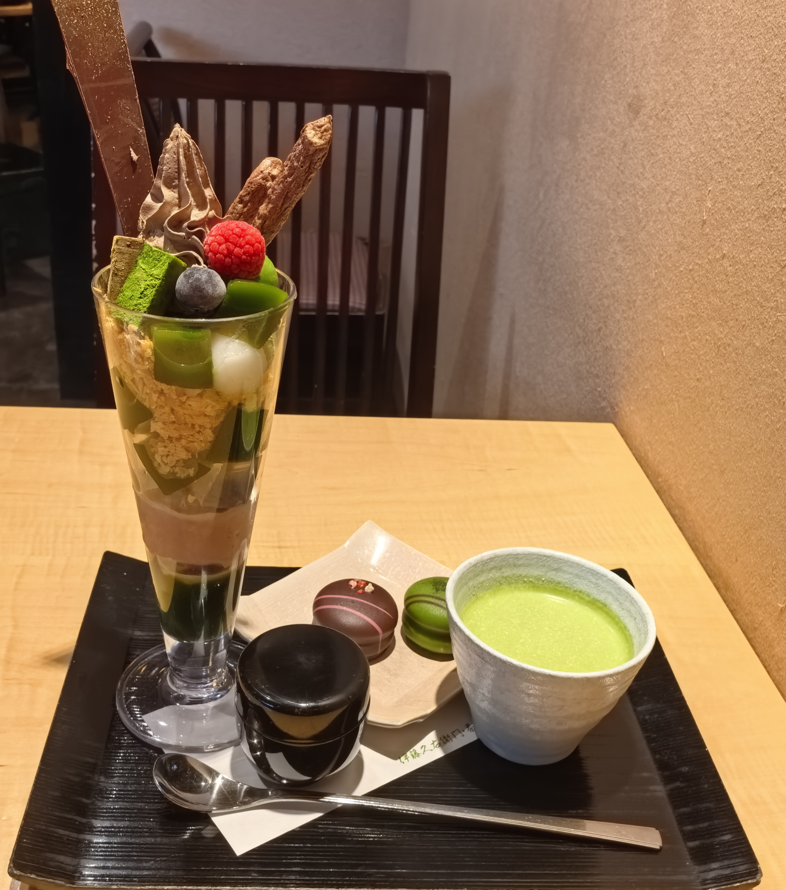
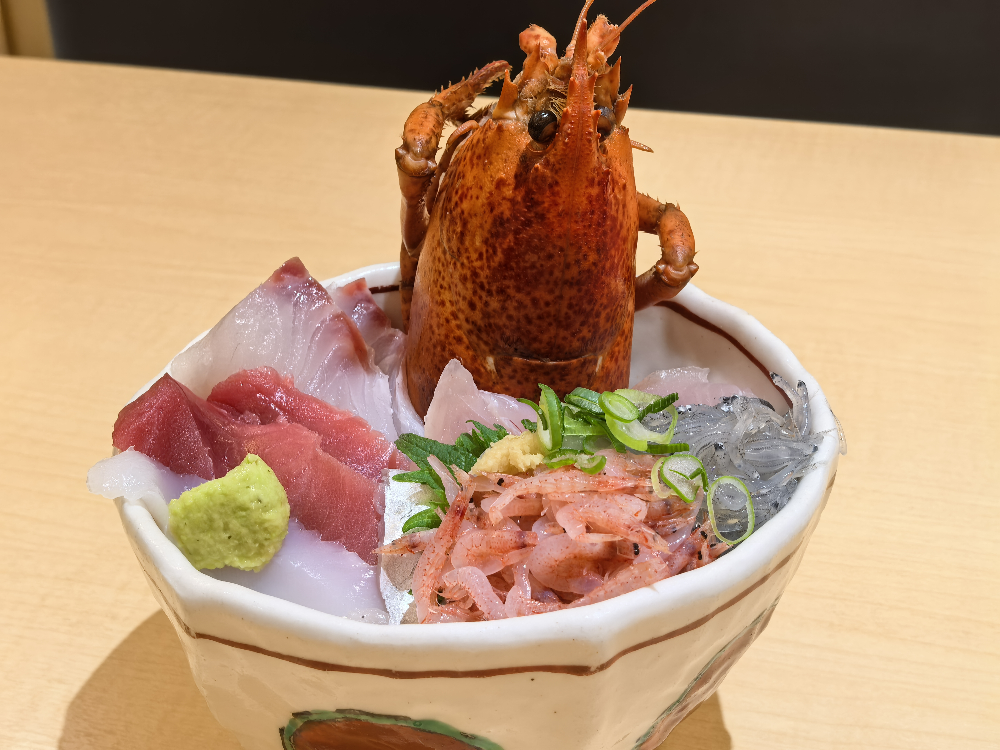

# 从大阪到东京：关西、中部、关东动漫圣地巡礼路线复盘

这次日本行的主线很清楚：从德国法兰克福出发，经上海转机入境大阪，再从关西一路向东，完成京都、宇治、丰乡、沼津、东京的动漫巡礼。原计划里有河口湖，但因为大雪和交通不确定，临时改去沼津，结果反而成了全程最高光的一段。

最终实际路线大致是：

```text
FRA 法兰克福 -> PVG 上海 -> KIX 大阪关西
大阪 -> 奈良 -> 京都 -> 宇治 -> 丰乡 -> 沼津 -> 东京
HND 羽田 -> PEK 北京 -> FRA 法兰克福
```

## 1. 出发和入境：德国经中国到大阪

去程不是德国直飞日本，而是法兰克福到上海，再从上海飞大阪关西机场。上海中转时间大约 20 小时，所以不是普通短转机，而是可以入境中国、取行李、第二天重新托运的长中转。

这个路线的关键点是行李。虽然航程连着买，但行李实际只到上海，需要在上海入境后取出，第二天再重新托运到大阪。流程大概是：

1. 法兰克福值机，拿 FRA -> PVG 和 PVG -> KIX 登机牌。
2. 行李托运到上海。
3. 上海入境中国，取托运行李。
4. 休息或短暂停留。
5. 第二天重新值机、重新托运行李。
6. 抵达 KIX 后入境日本。

到达关西机场后，先处理最基础的几件事：入境、取行李、办或启用 ICOCA、取现金。我当时取了 50,000 日元现金。日本大城市刷卡和电子支付已经很普遍，但巡礼点、小店、储物柜、景区和乡下交通，现金仍然能救命。

## 2. Day 1：大阪入境日

第一天路线很简单：

```text
KIX 关西机场 -> 大阪市区 -> 心斋桥 / 道顿堀
```

这一天不要排太满。第一次落地日本，真正要完成的是入境、取现、交通卡、到酒店、适应日本交通和街道节奏。晚上去心斋桥、道顿堀刚好：招牌密集、餐饮多、夜景强，很有“终于到日本了”的落地感。

大阪更适合作为缓冲站，而不是一上来就暴走。


*落地后的第一晚，道顿堀和心斋桥把“终于到日本了”的感觉一下子拉满。*

## 3. Day 2：大阪、奈良、京都

第二天是经典关西移动：

```text
大阪 -> 奈良 -> 京都
```

上午可以简单看大阪城或大阪市区，中段去奈良公园和东大寺，晚上到京都。奈良适合作为大阪到京都之间的半日过渡，路线顺，节奏也刚好从大阪的商业感切到古都和自然氛围。

这一天的重点不是“刷满所有景点”，而是完成城市切换。拖着行李时尤其要提前想好寄存，不要把自己变成移动仓库。


*上午从大阪城开始，把关西第一段行程的城市感建立起来。*


*奈良适合夹在大阪和京都之间，节奏会自然慢下来。*

## 4. Day 3：京都和宇治

第三天是关西段核心：

```text
伏见稻荷 -> 清水寺 / 二年坂三年坂 / 八坂神社 -> 宇治 -> 京都商店街
```

京都热门点一定要早起。伏见稻荷如果晚去，千本鸟居基本就是人挤人；早上去才能拍到比较干净的画面。清水寺、二年坂三年坂和八坂神社也一样，越晚人越多。


*早起去伏见稻荷的回报很直接：鸟居之间终于有能呼吸的空隙。*


*清水寺这一段基本靠走，天气和人流都会直接影响体验。*

下午去宇治，是《響け！ユーフォニアム》的核心巡礼线。宇治桥、宇治川、平等院、抹茶甜品店、京吹取景地，都很适合慢慢走。宇治和京都市区的气质完全不同：城市更小，河边更安静，作品记忆和现实地点叠在一起的感觉更强。


*宇治不只是观光点，更像是把京阿尼作品记忆放回现实街道里。*



*抹茶甜品不是单纯补给，它会和宇治这个地点本身绑定在一起。*

晚上回京都后，可以补玉子市场相关商店街。这样 Day 3 实际上变成了“京都传统观光 + 京阿尼作品巡礼 + 宇治京吹核心巡礼”。


*玉子市场相关商店街更像隐藏支线，适合放在京都夜晚收尾。*

## 5. Day 4：丰乡小学，然后临时改道沼津

第四天原计划很硬：

```text
京都 -> 丰乡小学校旧校舍群 -> 河口湖
```

丰乡小学是《K-ON!》非常重要的巡礼地。它交通不算方便，对普通游客吸引力没那么强，但对作品粉丝非常值。校舍、楼梯、部室、周边小店，都有一种不是商业景点、而是真正为了作品走到这里的感觉。


*丰乡小学的魅力在于它不像普通景点，更像把作品里的部室空气保留下来了。*

问题出在后半段：河口湖大雪，交通不稳定。冬天去富士山周边，最大的风险不只是看不到山，而是进不去、出不来，或者后面东京行程被连带打乱。

最后我没有硬冲河口湖，而是改去沼津。这个决定非常正确。

沼津作为替代方案有几个优势：

- 靠近三岛，能接东海道新干线和 JR 干线。
- 仍然有看富士山的机会。
- 是 LoveLive! Sunshine!! 核心圣地。
- 有骏河湾和海鲜。
- 第二天进东京比从河口湖脱困稳定得多。

晚上在沼津吃了魚がし鮨本店，比纯游客区回转寿司更有地方鱼获特色，也成了这次临时改线后的惊喜。



*临时改到沼津之后，骏河湾海鲜成了第一份补偿。*

## 6. Day 5：沼津 LoveLive! Sunshine!! 巡礼

第五天是整趟旅行最惊喜的一天：

```text
沼津 -> 三津 / 淡岛方向 -> 骏河湾富士山 -> 东京
```

沼津的巡礼密度很高。市区、三津、淡岛、水族馆、港口、LoveLive 痛船、骏河湾海岸线，都和 LoveLive! Sunshine!! 绑定得很深。

这一天最有记忆点的是骏河湾、富士山和痛船同框。原本河口湖看富士山失败，但沼津给了另一种更有个人主题的富士山：不是单纯风景，而是“海 + 富士山 + 动漫巡礼”的组合。


*这张就是河口湖取消后的神展开：富士山、骏河湾、LoveLive 痛船全都赶上了。*

下午或晚上从沼津去东京也很顺：

```text
沼津 -> 三岛 -> 东京
```

这就是为什么沼津是高质量替代方案。它不是随便找个地方避险，而是同时保住了富士山、巡礼、海鲜和后续交通。

## 7. 东京阶段：二次元主战场

东京阶段的核心区域包括：

- 秋叶原：周边、手办、CD、BD、二次元店、中古店。
- 下北泽：孤独摇滚和现实乐队文化氛围。
- 池袋：二次元商业区和动漫店。
- 涩谷：现代东京感、夜景、SHIBUYA SKY。
- 新宿：城市密度、交通枢纽和夜景。
- 台场：海湾景观和商业设施。
- 浅草：传统东京观光。

秋叶原适合第一次朝圣式体验，但不要低估它的时间黑洞属性。下北泽则更适合喜欢乐队番、MyGO!!!!!、Ave Mujica、Girls Band Cry、K-ON! 这类作品的人，它的现实音乐场景和动画舞台感是连在一起的。

东京还很适合用长焦拍街景：坡道、铁路、十字路口、城市压缩感，都能拍出很干净的画面。《你的名字。》相关地点和东京坡道巡礼，也很适合放进东京段。


*SHIBUYA SKY 或类似高处视角很适合第一次东京旅行，用来建立城市尺度。*


*东京塔近距离夜景更像城市巡礼的注脚，路牌和塔同框很有现场感。*


*台场适合作为东京段的海湾支线，独角兽高达是很稳定的二次元地标。*

## 8. 交通和行李经验

ICOCA 很实用。它能覆盖大阪、京都、奈良、JR 普通线路，到了东京也能继续刷。第一次日本多城市自由行，IC 卡能减少大量买票和换乘时的心理成本。

长距离移动要灵活。大阪、京都、名古屋、三岛、东京这些大动脉问题不大，真正影响行程的是冬天山区和富士山周边天气。票不一定是最大问题，天气和交通中断才是。

行李不要拖去所有巡礼点。丰乡、宇治、沼津这种地方，轻装体验会好很多。退房后跨城市移动，优先考虑酒店寄存、车站 coin locker 或可靠店铺寄存。

## 9. 可复用行程模板

如果下次复刻类似路线，可以这样安排：

```text
Day 1  大阪落地，心斋桥 / 道顿堀
Day 2  大阪 -> 奈良 -> 京都
Day 3  京都早起观光 -> 宇治京吹巡礼
Day 4  京都 -> 丰乡 K-ON! -> 静冈方向
Day 5  沼津 LoveLive! Sunshine!! -> 东京
Day 6  秋叶原 / 池袋 / 下北泽
Day 7  涩谷 / 新宿 / 台场 / 浅草
```

冬天如果安排河口湖，一定提前准备替代方案。沼津、三岛、静冈一线就是很好的备选：交通稳、接东京方便，而且富士山和动漫巡礼都有。

## 10. 一句话总结

这次旅行最成功的地方，不是完全按原计划执行，而是在河口湖大雪时果断改线，把一次可能失败的富士山行程，变成了沼津、骏河湾、LoveLive 痛船、海鲜寿司和富士山同框的高质量巡礼。
